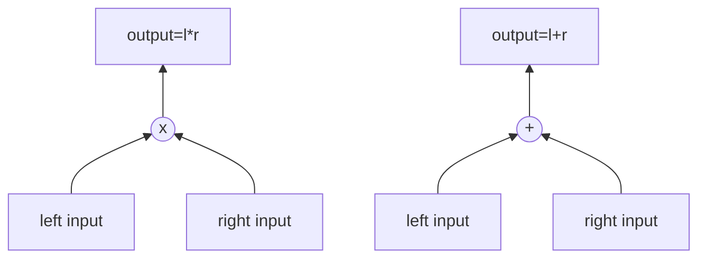

# DSL

introduces a simple DSL, originally from 0xPARC's [Plonkathon](https://github.com/0xPARC/plonkathon), for writing circuits that can be compiled to polynomials specific to PLONK prover's algorithm.

let's take an example to compute $x^3 + x + 5$:

```DSL
x public
x2 <== x * x
out <== x2 * x + 5
```

Each line of DSL is a separate constraint. It's parsed and converted to corresponding `WireValues`, i.e. variables and coefficients for each wire. Vanilla PLONK supports fan-in 2 arithmetic (`add` and `mul`) gates, so each constraint can only support a maximum of 1 output and 2 distinct input variables with numeric constants.

## Parser rules

- supports `<==` for assignment and `===` for arithmetic equality checks
- mark variables as `public` in the beginning of the program.
- only supports quadratic constraints, i.e. don't support `y <== x * x * x`.
- each token should be separated by space.

Outputs parsed output in form of `WireCoeffs` values and coefficients.
- `wires`: represent variables corresponding to gate wires in each constraint.
- `coefficients`: coefficient corresponding to each variable.


```rust
use std::collections::HashMap;
/// Values of wires with coefficients of each wire name
#[derive(Debug, PartialEq)]
pub struct WireCoeffs<'a> {
  /// variable used in each wire
  pub wires:  Vec<Option<&'a str>>,
  /// coefficients of variables in wires and [`Gate`]
  pub coeffs: HashMap<String, i32>,
}
```

### Example parser outputs

- `x public` =>                    `(['x', None, None], {'$public': 1, 'x': -1, '$output_coeffs': 0}`
- `b <== a * c` =>                 `(['a', 'c', 'b'], {'a*c': 1})`
- `d <== a * c - 45 * a + 987` =>  `(['a', 'c', 'd'], {'a*c': 1, 'a': -45, '$constant': 987})`

Some default coefficients are used for certain constraints:
- `$constant`: for constant variables
- `$output_coeffs`: for output variables. Example: `-a <== b * b` has `$output_coeffs` as `-1`
- `$public`: for public variable declarations

Our example wire values gets parsed as:

- `x public` => `['x', None, None], {'$public': 1, 'x': -1, '$output_coeffs': 0}`
- `x2 <== x * x` => `['x', 'x', 'x2'], {'x*x': 1}`
- `out <== x2 * x + 5` => `['x2', 'x', 'out'], {'x2*x': 1, '$constant': 5}`

## Gate

Gate represents the values corresponding to each wire in a gate:



```rust
use ronkathon::algebra::field::prime::PlutoScalarField;
/// Fan-in 2 Gate representing a constraint in the computation.
/// Each constraint satisfies PLONK's arithmetic equation: `a(X)QL(X) + b(X)QR(X) + a(X)b(X)QM(X) +
/// o(X)QO(X) + QC(X) = 0`.
pub struct Gate {
  /// left wire value
  pub l: PlutoScalarField,
  /// right wire value
  pub r: PlutoScalarField,
  /// output wire, represented as `$output_coeffs` in wire coefficients
  pub o: PlutoScalarField,
  /// multiplication wire
  pub m: PlutoScalarField,
  /// constant wire, represented as `$constant` in coefficients
  pub c: PlutoScalarField,
}
```

Taking our example:
- `x public` => `['x', None, None], {'$public': 1, 'x': -1, '$output_coeffs': 0}`
  - gate values are: `{'l': 1, 'r': 0, 'o': 0, 'c': 0, 'm': 0}`
- `x2 <== x * x` => `['x', 'x', 'x2'], {'x*x': 1}`
  - gate values: `{'l': 0, 'r': 0, 'm': -1, 'o': 1, 'c': 0}`
- `out <== x2 * x + 5` => `['x2', 'x', 'out'], {'x2*x': 1, '$constant': 5}`
  - gate values: `{'l': 0, 'r': 0, 'm': -1, 'o': 1, 'c': 5}`

## Program

Creates a program from the parsed DSL output containing required polynomials used for PLONK
proving step.

Converts `WireValues` to required polynomials in PLONK, i.e.
- Preprocessed polynomials:
    - selector polynomials: $[Q_L,Q_R,Q_M,Q_O,Q_C]$
    - permutation helpers: $[S_1,S_2,S_3]$

To get selector polynomials from constraints, each constraint is parsed into fan-in 2 arithmetic gates as explained above and wire values are assigned to respective wires in lagrange form.

```rust
/// `CommonPreprocessedInput` represents circuit related input which is apriori known to `Prover`
/// and `Verifier` involved in the process.
 use ronkathon::{
  polynomial::{Lagrange, Polynomial},
   algebra::field::{Field,prime::PlutoScalarField}
};

pub struct CommonPreprocessedInput<const GROUP_ORDER: usize> {
  /// multiplicative group order
  // group_order: usize,
  /// Q_L(X): left wire selector polynomial
  pub ql: Polynomial<Lagrange<PlutoScalarField>, PlutoScalarField, GROUP_ORDER>,
  /// Q_R(X): right wire selector polynomial
  pub qr: Polynomial<Lagrange<PlutoScalarField>, PlutoScalarField, GROUP_ORDER>,
  /// Q_M(X): multiplication gate selector polynomial
  pub qm: Polynomial<Lagrange<PlutoScalarField>, PlutoScalarField, GROUP_ORDER>,
  /// Q_O(X): output wire selector polynomial
  pub qo: Polynomial<Lagrange<PlutoScalarField>, PlutoScalarField, GROUP_ORDER>,
  /// Q_C(X): constant selector polynomial
  pub qc: Polynomial<Lagrange<PlutoScalarField>, PlutoScalarField, GROUP_ORDER>,
  /// S_σ1(X): first permutation polynomial
  pub s1: Polynomial<Lagrange<PlutoScalarField>, PlutoScalarField, GROUP_ORDER>,
  /// S_σ2(X): second permutation polynomial
  pub s2: Polynomial<Lagrange<PlutoScalarField>, PlutoScalarField, GROUP_ORDER>,
  /// S_σ3(X): third permutation polynomial
  pub s3: Polynomial<Lagrange<PlutoScalarField>, PlutoScalarField, GROUP_ORDER>,
}
```

### Permutation arguments

PLONK handles copy constraint across trace using multiset arguments, also called permutation arguments that essentially proves that set $f=\{f_1,f_2,\dots,f_n\}, g=\{g_1,g_2,\dots,g_n\}$ are permutation of each other in the domain, i.e. $g_i=f_{\sigma(i)} \space \forall i \in [1,n]$. For more info on permutation arguments, please check out resources mentioned in references.

$$
\prod_{i=0}^{n}(g_i+i)=\prod_{i=0}^{n}(f_{\sigma(i)}+\sigma(i))
$$

permutation helper creates $\sigma_i$ polynomials for $i = \{1,2,3\}$.

- creates a execution trace of n rows for each constraint, and 3 columns representing each wires in a gate: LEFT, RIGHT, OUTPUT
- parses each constraint and create a map of variable usage across constraints in tuples of rows and columns.
  - In our example: 3 distinct variable exist, then map of variable usage is `{'x': [(1, LEFT), (2, LEFT), (2, RIGHT), (3, RIGHT)], 'x2': [(2, OUTPUT), (3, LEFT)], 'out': [(3, OUTPUT)]}`
- to create $g_i$, and $f_i$, shifts each variable usage by 1 to right, i.e. variable at $x_i = x_{i+1}$.
  - for example: x's usage gets shifted 1 to right, new one becomes: `{'x': [(3, RIGHT), (1, LEFT), (2, LEFT), (2, RIGHT)]}`.
  - This ensures that variables `x` is copied from $x_i$ to $x_{i+1}$

```rust
 use ronkathon::compiler::parser::WireCoeffs;

/// `Program` represents constraints used while defining the arithmetic on the inputs
/// and group order of primitive roots of unity in the field.
#[derive(Debug, PartialEq)]
pub struct Program<'a> {
  /// `constraints` defined during arithmetic evaluation on inputs in the circuit
  constraints: Vec<WireCoeffs<'a>>,
  /// order of multiplicative group formed by primitive roots of unity in the scalar field
  group_order: usize,
}
```

## References

- [0xPARC's plonkathon compiler](https://github.com/0xPARC/plonkathon/tree/main/compiler)
- [PLONK by hand: Part 2](https://research.metastate.dev/plonk-by-hand-part-2-the-proof/)
- [on PLONK and PLOOKUP](https://research.metastate.dev/on-plonk-and-plookup/)
- [Plonk's permutation, the definitive explanation](https://www.cryptologie.net/article/610/plonks-permutation-the-definitive-explanation/)