# Symmetric Encryption algorithms

[Symmetric encryption](https://en.wikipedia.org/wiki/Symmetric-key_algorithm) algorithms are cryptographic algorithms that uses same key for encryption and decryption.

## Block Ciphers

TODO

## Stream ciphers

[stream ciphers](https://en.wikipedia.org/wiki/Stream_cipher) are symmetric encryption cryptography primitives that works on digits, often bits, rather than fixed-size blocks as in [block-ciphers](https://en.wikipedia.org/wiki/Block_cipher).

$$
\begin{align*}
\operatorname{Enc}(s,m)=c=G(s)\oplus m \\
\operatorname{Dec}(s,c)=m=c \oplus G(s)
\end{align*}
$$

- Plaintext digits can be of any size, as cipher works on bits, i.e. $c,m\in \{ 0,1 \}^{L}$
- $G$ is a PRG that generatoes **Keystream** which is a pseudorandom digit stream that is combined with plaintext to obtain ciphertext.
- Keystream is generated using a seed value using **shift registers**.
- **Seed** is the key value required for decrypting ciphertext.
- Can be approximated as one-time pad (OTP), where keystream is used only once.
- Keystream has to be updated for every new plaintext bit encrypted. Updation of keystream can depend on plaintext or can happen independent of it.

```mermaid
flowchart LR
k[Key]-->ksg["Key Stream Generator"]
ksg--s_i-->xor
x["Plaintext (x_i)"]:::hiddenBorder-->xor["⊕"]
xor-->y_i
y_i["Ciphertext (y_i)"]-.->ksg
```

Now, encryption in stream ciphers is just XOR operation, i.e. $y_{i}=x_{i} \oplus s_{i}$. Due to this, encryption and decrpytion is the same function which. Then, comes the major question:

## Implementations

- [ChaCha stream cipher](./chacha/README.md)