# DES encryption

[DES][des] is a symmetric encryption algorithm based on Feistel cipher. It has following properties:

- Message block size is **64-bits**.
- Key size is 64 bytes, where every 8th bit is parity bits, so realized key size is **56 bits**.
- Encryption algorithm is based on [Feistel cipher][feistel] containing **16 identical rounds** with new subkey for each round derived using Key Schedule algorithm.
- Encryption algorithm divides 64 bit message into two halves of 32 bits and then, acted upon by round functions.
- Due to structure of Feistel ciphers, encryption and decryption algorithms, only difference in decryption algorithm being subkeys are reversed.
- Since, key size is 56-bits, it's prone to **brute force attacks**, where exhaustive key search is done to calculate the key for known plaintext.

## Implementation details

- limbs of `8 bits` are used to denote different types, i.e. `64, 56, 48, 32` in the encryption function.
- all data is represented in **big-endian** order.
- Refer to [tests](./tests.rs) for detailed examples and attack vectors.
  - Known-plaintext attack: brute force approach using exhaustive key search on the complete key space, i.e $[0,1<<2^{56}-1]$.
  - Weak key attack: 4 weak keys are possible where encryption and decryption are same. This is only possible when all round subkeys are identical.
  - bit complement: DES has a nice property where $y=ENC_k(x)$ and $y'=ENC_{k'}(x')$

## Permutation

Shuffles the bits according to permutation table based on indexes. Let's understand this with an example from [Simplified DES][sdes]:

Let a 10-bit key be denoted as: $K=(k_1,k_2,\dots,k_{10})$, and a permutation table defined as:

$$
\begin{matrix}
3 &5 &2 &7 &4 &10 &1 &9 &8 &6
\end{matrix}
$$

Applying permutation $P$ to key $K$, $P(K)=(k_3,k_5,k_2,k_7,k_4,k_{10},k_1,k_9,k_8,k_6)$.

> [!NOTE]
> Permutation table length can vary according to the bits required in the output. Let's say, if $P=[3,5]$, then output will be only 2 elements of the key, i.e. $k_3, k_5$. This is used throughout DES to reduce or increase data lengths.

## Substitution

DES uses substitution in the form of S-boxes in it's encryption algorithm. Substitution is necessary, as it provides non-linearity in the cipher. Without non-linearity, DES's encryption function could be represented as a set of linear equations on the secret key variable.

DES performs substitution on 6-bit data and gives 4-bit data. It's implemented as a lookup table, where the row and column from the input data = $(100110)_2$ is read as:

- row: $(6,1)$ bits, i.e. 6th and 1st bit = $(10)_2=2$
- column: $(5,4,3,2)$ bits = $(0011)_2=3$

Thus, input data $38$ represents 3rd row, 4th column in the $4\times 16$ permutation lookup table.

## Key schedule algorithm

derives 16 48-bit subkeys, 1 for each round.

- Permutation choice-1: drops every 8th bit and permutes bits
- 56-bit key is divided into two 28-bit halves.
- left shift is applied to both halves depending on the key schedule round.
- Permutation choice-2 is applied reducing 56-bit key to 48-bit subkey.
- repeated for 16 rounds

## Encryption algorithm

16 rounds with five functions in the order:

- Initial permutation (IP)
- Feistel function (F): applies substitution and permutation to key
- Mixing: mix two halves together
- Switching: switches left and right halves
- Final Permutation (FP)

### Feistel function

Applies substitution, permutation to key which adds to the complexity of the function and increases cryptanalysis difficulty. For substitution, DES uses S-boxes that takes as input 8-bits and output is of length 6-bits.

```mermaid
flowchart TB
key--32 bits-->Exp[Expansion]
Exp--48 bits-->Mix["⊕"]
Sub[Subkey]--48 bits-->Mix
Mix--8-->s1
Mix--8-->s2
Mix--8-->s3
Mix--8-->s4
Mix--8-->s5
Mix--8-->s6
Mix--8-->s7
Mix--8-->s8
s1--6-->P[Permutation]
s2--6-->P
s3--6-->P
s4--6-->P
s5--6-->P
s6--6-->P
s7--6-->P
s8--6-->P
P--32 bits-->Output:::hidden
```

- Takes as input one half of the key, 32 bits
- use **Expansion** permutation to increase bits to **48**
- Mix the expanded key with round's subkey using xor
- Divides 48-bit output into 8 6-bits elements
- Applies substitution using 8 S-boxes to each element
- Applies permutation using permutation table to get **32-bit** output

[sdes]: http://mercury.webster.edu/aleshunas/COSC%205130/G-SDES.pdf
[des]: https://en.wikipedia.org/wiki/Data_Encryption_Standard
[feistel]: https://en.wikipedia.org/wiki/Feistel_cipher
