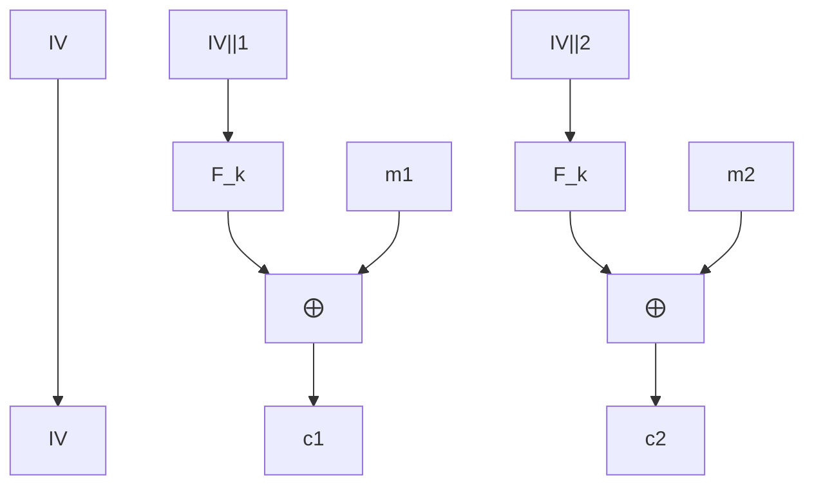
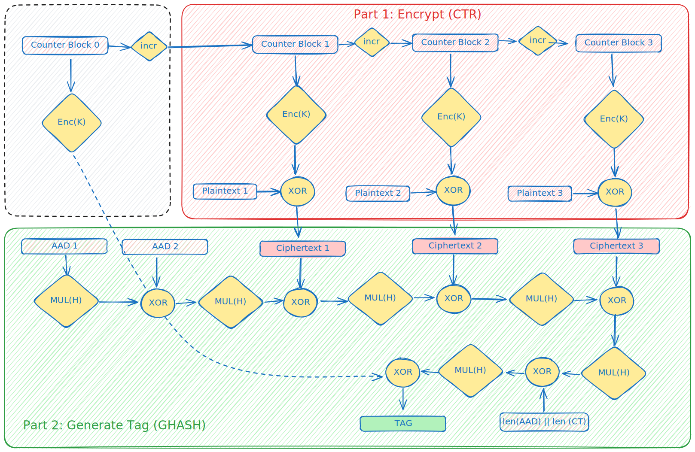

# Modes of Operation

Block ciphers can only do fixed length encryption of bits in a well-defined Block. Modes of operation allows to extend cipher's encryption/decryption algorithms to allow arbitrary length data.

Some operations require *Initialisation vector* (IV) that must not repeat for subsequent encryption operations, and must be random for some operations. IV is used so that different ciphertext is generated for same plaintext even for a single key. We demonstrate this in our [tests](./cbc.rs).

Appropriate padding has to be performed for some modes, as block ciphers only work of fixed size blocks. Since, most of the ciphers are used with [MAC](https://en.wikipedia.org/wiki/Message_authentication_code) that provides integrity guarantees and prevent Chosen-Ciphertext attacks on the protocol, so, [any](https://crypto.stackexchange.com/questions/62379/choice-of-padding-scheme-to-prevent-cbc-padding-oracle-attacks) padding scheme works, most common is PKCS#7 or even null byte padding. Note that, without use of MACs, almost all block ciphers with padding are susceptible to [Padding Oracle Attacks](https://en.wikipedia.org/wiki/Padding_oracle_attack) and should be handled with utmost care.

Let's go into detail about Block cipher's [mode of operation](https://en.wikipedia.org/wiki/Block_cipher_mode_of_operation):

## ECB: Electronic codebook
- deterministic, so not CPA-secure.
- can be parallelised easily.
## CBC: cipher block chaining
- IV chosen uniformly and $c_{0}=IV$, then $c_{i}=F_{k}(c_{i-1} \oplus m_{i})$
- sequential in nature, although decryption can be parallelised as inputs to block cipher's encryption is just the ciphertext
- chained CBC, where ciphertext is chained for subsequent encryptions.
  - But it's not CPA secure, as attacker can distinguish between PRF and uniform random function by choosing appropriate text in second encryption.
## OFB: output feedback
- IV is chosen uniformly and $y_{0}:=IV$, then $y_{i}=F_{k}(y_{i-1})$ and $c_{i}=y_{i} \oplus m_{i}$.
- this allows $F_{k}$ to not be invertible, and can be simply a PRF.
- Due to this, OFB can be used to encrypt plaintext of arbitrary lengths and not have to be multiple of block length.
- pseudorandom stream can be preprocessed and then encryption can be really fast.
- it's stateful variant can be used to instantiate stream cipher's synchronised mode of operation and is secure.
## CTR: counter mode
- can be viewed as unsynchronised stream cipher mode, where $y_{i}=F_{k}(\langle IV \parallel i\rangle)$ for binary string $i = 1,2,\dots,$ and $c_{i}=y_{i}\oplus m_{i}$.
- this again allows $F_{k}$ to not be invertible and can be instantiated with a Pseudorandom function.
- can be fully parallelised.

## GCM: Galois/Counter Mode

GCM is a block cipher mode of operation that provides both confidentiality and authentication.
To provide confidentiality, it uses CTR mode for encryption and decryption.
To provide authentication, it uses a universal hash function, GHASH.
Authentication is provided not only for confidential data but also other associated data.

In this section, we will give an informal overview of GCM mode for 128-bit block cipher.
*To see the formal definition of the operations of GCM, I recommend reading the original paper. [The Galois/Counter Mode of Operation (GCM)](https://csrc.nist.rip/groups/ST/toolkit/BCM/documents/proposedmodes/gcm/gcm-revised-spec.pdf)*

The two operations of GCM are authenticated encryption and authenticated decryption.

Here is a figure that gives a complete overview of the authenticated encryption in GCM. 

In the figure, we have taken
- the size of plaintext is `3 * 128-bit = 384 bits or 48 bytes`, 
- Additionally Authenticated Data(AAD) is of `2 * 128-bit = 248 bits or 32 bytes`.

If you look at the figure carefully, you will notice that the GCM mode is composed of two main parts:
- Encryption: This part is the same as the CTR mode of operation, with minor changes to the counter block.
- Authentication: In this part, we generate an authentication tag for the ciphertext and some additional data, which we refer to as Additionally Authenticated Data(AAD).

The authentication algorithm itself has two parts.
- GHASH: We hash the ciphertext along with AAD. This can be viewed as a series of `ADD and MULTIPLY`, mathematically, $J_{i} = ( J_{i-1} \oplus X_{i} ) * H$
- The GHASH value is XOR-ed with the encryption of `Counter Block 0` to generate the final tag.

The interesting thing to note here is that the multiplication($*$) and addition($\oplus$) are operations of the Galois(finite) field of order $2^{128}$. 
A brief summary of finite field arithmetic is, 
- The elements of the field can be represented as polynomials.
- Addition in a finite field is equivalent to bitwise XOR.
- Multiplication in a finite field is the multiplication of corresponding polynomials divided by an irreducible reducing polynomial.

In GCM the reducing polynomial is $f = 1 + x + x^2 + x^7 + x^128$

If you want to read about Finite Field, the Wikipedia article on [Finite Field Arithemtic](https://en.wikipedia.org/wiki/Galois/Counter_Mode) is pretty good!

Authenticated decryption operation is identical to authenticated encryption, except the tag is generated before the decryption.

## Next Steps
Implement more modes, and subsequent attacks/vulnerabilities:
- [ ] CFB
- [ ] OFB

## References

- [Understanding Cryptography by Cristof Paar & Jan Pelzl & Tim Güneysu: Chapter 3, 4](https://www.cryptography-textbook.com/)
- [Introduction to Modern Cryptography: Section 1](https://www.cs.umd.edu/~jkatz/imc.html)
