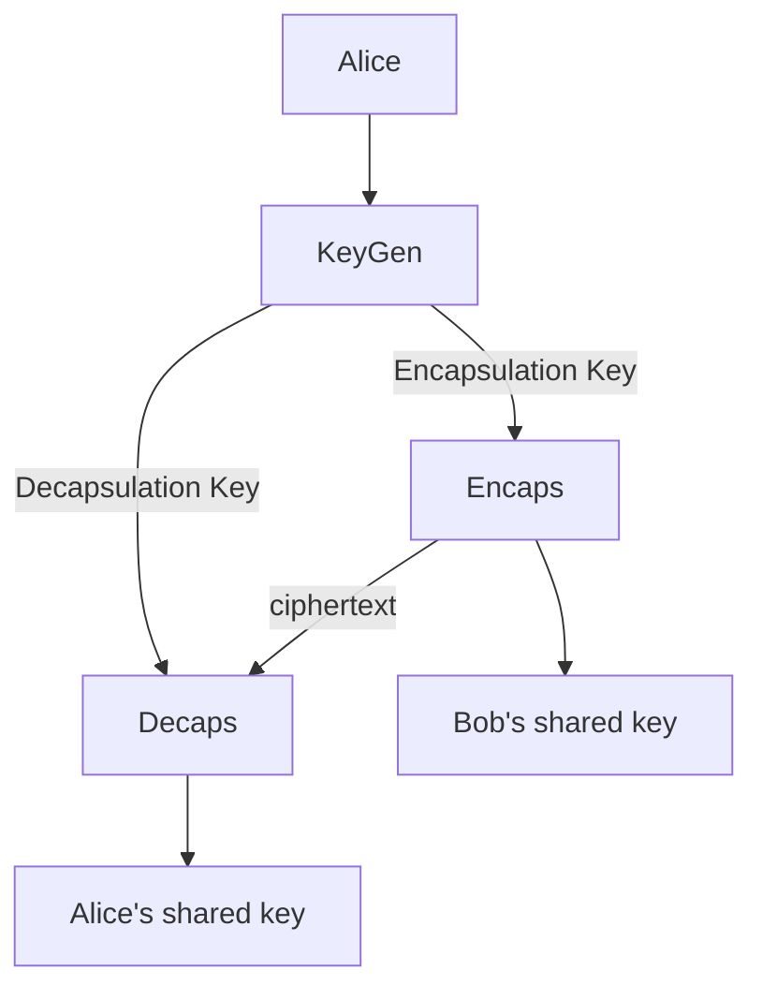

# Key Encpasulation Mechanism

## ToC
- What is KEM?
- How is it useful?
- Security

KEM is a cryptographic algorithm, that is used to establish a shared key between two parties on a untrusted channel.

KEM consists of three algorithms:
- $\text{KeyGen}$: Generates encapsulation and decapsulation keys
- $\text{Encaps}$: Encapsulates key and ciphertext that is sent to other part to generate shared key
- $\text{Decaps}$: Generates shared key from decapsulation key

